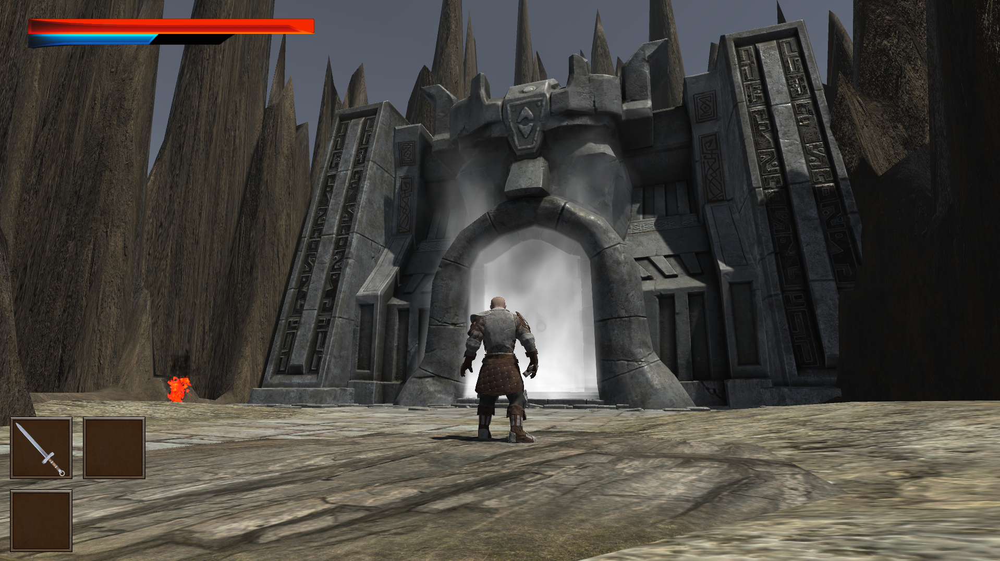

<!-- HEADER --!>

<h1> AcientRuins </h1>

  

<li> 개발기간: 2024.03.01 ~ 2024.06.12
<li> 개발인원: <a href="https://github.com/LimHyeongGyun">LimHyeongGyun</a>, <a href="https://github.com/LSeungHyun">LSeungHyun</a>
<li> 형상관리툴: PlasticSCM
<li> GitHub.Io: <a href="LimHyeongGyun.github.io">AcientRuins.Io</a>

<!-- Contents --!>
<h2 id="table-of-contents"> :book: 목차 </h2>

  
목차

  <ol>
    <li><a href="#about-the-project"> 프로젝트 설명 </a></li>
    <li><a href="#overview"> 게임개요 </a></li>
    <li><a href="#project-files-description"> 프로젝트 파일 </a></li>
    <li><a href="#tech"> 기술/프레임워크 </a></li>
    <li><a href="#screen-shot"> 스크린샷</a></li>
    <li><a href="#spreadsheet-link"> 다이얼로그 시트 </a></li>
    <li><a href="#download-link"> 게임 다운로드 </a></li>
  </ol>

<h2 id="about-the-project"> 1. 프로젝트 설명 </h2>

<b> 소울라이크 3D 액션RPG </b>

AcientRuins는 장비를 파밍하고 적들을 물리쳐 성장하는 소울라이크 3D 액션 RPG입니다.
불편한 조작감을 성장한 스탯과 컨트롤을 통해 보스몬스터를 깨는 것이 목적입니다.

<h2 id="overview"> 2. 게임개요 </h2>
게임 제작은 <a href="https://github.com/LimHyeongGyun">LimHyeongGyun</a>과 <a href="https://github.com/LSeungHyun">LSeungHyun</a> 이 함께 개발을 진행하였습니다.  
<a href="https://github.com/LimHyeongGyun">LimHyeongGyun</a>은 기획, 클라이언트 개발을 담당하고 있습니다. 기획, 플레이어 동작 기능, 다이얼로그, 게임시스템, 데이터를 담당하였습니다.

(readme 작성자인 LimHyeongGyun의 파트만 기술 하였습니다.)

<h2 id="project-files-description"> 3. 프로젝트 파일 (AcientRuins/Script/) </h2>
<li><b>/Inventory</b> - </li>
<li><b>/Item</b> -  </li>
<li><b> /Manager</b> - </li>
<li><b> /Npc </b> -  </li>
<li><b> /Player </b> -  </li>
<li><b> /System </b> -  </li>

<h2 id="tech"> 4. 기술/프레임워크 </h2>
<li>Programming </li>
<li>Framework </li>

<h2 id="screen-shot"> 5. 스크린샷</h2>

</a>
</a>
</a>
 

<게임 플레이 사진>

<h2 id="spreadsheet-link"> 6.다이얼로그시트</h2>
<li>https://docs.google.com/spreadsheets/d/1qUaobVFt9pj3BaDbAQAHjnOD9yyasFep-4rz-QBoq8E/edit?gid=0#gid=0
<h2 id="download-link"> 7.게임 다운로드</h2>
<li>https://drive.google.com/drive/folders/1SL0G-FXH0FqEGWVkzLijlPPWnmBeDm_R
